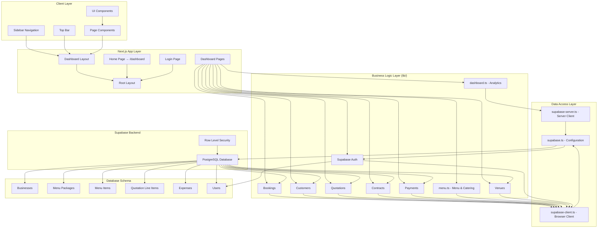
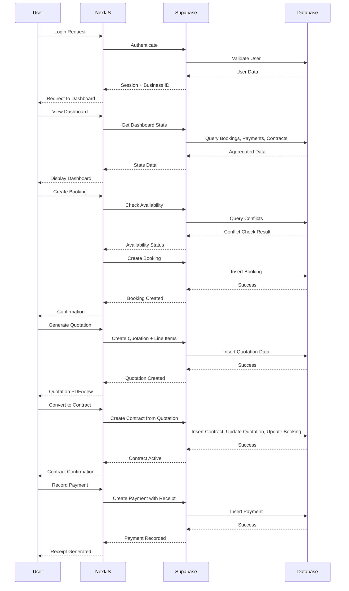

# Grand Alnoor ERP - Architecture Diagram

## System Overview
Grand Alnoor ERP is a comprehensive event venue management system built with Next.js 16, React 19, and Supabase. It manages bookings, customers, quotations, contracts, payments, and catering for event venues.

## Technology Stack
- **Frontend**: Next.js 16.2.9 (App Router), React 19.2.4, TypeScript 5
- **Styling**: Tailwind CSS v4
- **Backend**: Supabase (PostgreSQL + Auth + RLS)
- **UI Components**: Custom components with Lucide React icons
- **Charts**: Recharts for analytics
- **Date Handling**: date-fns

## Architecture Diagram



## Data Flow Diagram



## Module Relationships

### Core Business Flow
1. **Customer Management** → Create customer profiles
2. **Venue Booking** → Check availability, create tentative booking
3. **Quotation Generation** → Create detailed quote with line items
4. **Contract Creation** → Convert accepted quotation to active contract
5. **Payment Processing** → Record payments against contracts
6. **Menu & Catering** → Manage menu packages for events

### Key Dependencies
- **Bookings** depend on: Venues, Customers
- **Quotations** depend on: Bookings, Customers
- **Contracts** depend on: Quotations, Bookings
- **Payments** depend on: Contracts
- **Menu Packages** are independent but used in Quotations

## File Structure

```
grand-alnoor-erp/
├── app/
│   ├── dashboard/           # Main dashboard pages
│   │   ├── bookings/        # Booking management
│   │   ├── customers/       # Customer directory
│   │   ├── quotations/      # Quote generation
│   │   ├── contracts/       # Contract management
│   │   ├── payments/        # Payment tracking
│   │   ├── menu/            # Menu & catering
│   │   ├── venues/          # Venue management
│   │   ├── settings/        # System settings
│   │   ├── layout.tsx       # Dashboard layout
│   │   └── page.tsx         # Dashboard home
│   ├── login/               # Authentication page
│   ├── layout.tsx           # Root layout
│   └── page.tsx             # Home redirect
├── components/
│   ├── bookings/            # Booking components
│   ├── contracts/           # Contract components
│   ├── customers/           # Customer components
│   ├── dashboard/           # Dashboard widgets
│   ├── layout/              # Layout components (Sidebar, TopBar)
│   ├── menu/                # Menu components
│   ├── payments/            # Payment components
│   ├── quotations/          # Quotation components
│   └── venues/              # Venue components
├── lib/
│   ├── auth.ts              # Authentication functions
│   ├── bookings.ts          # Booking logic
│   ├── contracts.ts         # Contract logic
│   ├── customers.ts         # Customer logic
│   ├── dashboard.ts         # Dashboard analytics
│   ├── menu.ts              # Menu management
│   ├── payments.ts          # Payment processing
│   ├── quotations.ts        # Quotation logic
│   ├── venues.ts            # Venue logic
│   ├── supabase.ts          # Supabase browser client
│   ├── supabase-client.ts   # Client helper
│   └── supabase-server.ts   # Server client helper
├── supabase/
│   ├── schema.sql           # Database schema
│   └── rls-policies.sql     # Security policies
└── public/                  # Static assets
```

## Database Schema Relationships

```
businesses (1) ──── (N) venues
businesses (1) ──── (N) customers
businesses (1) ──── (N) bookings
businesses (1) ──── (N) menu_packages
businesses (1) ──── (N) menu_items
businesses (1) ──── (N) quotations
businesses (1) ──── (N) contracts
businesses (1) ──── (N) payments
businesses (1) ──── (N) expenses
businesses (1) ──── (N) users

venues (1) ──── (N) bookings
customers (1) ──── (N) bookings
customers (1) ──── (N) quotations
customers (1) ──── (N) contracts

bookings (1) ──── (N) quotations
quotations (1) ──── (N) contracts
contracts (1) ──── (N) payments

menu_packages (N) ──── (N) menu_items (via menu_package_items)
quotations (1) ──── (N) quotation_line_items
```

## Security Architecture

- **Authentication**: Supabase Auth with session management
- **Authorization**: Row Level Security (RLS) policies on all tables
- **Multi-tenancy**: All data scoped by `business_id`
- **API Security**: Server-side client for sensitive operations, browser client for UI interactions
- **Input Validation**: TypeScript interfaces and database constraints

## Key Features

1. **Real-time Availability**: Conflict detection for venue bookings
2. **Financial Tracking**: Revenue analytics, outstanding balance calculations
3. **Quote-to-Contract Workflow**: Seamless conversion from quotation to contract
4. **Payment Management**: Receipt generation, refund handling, balance tracking
5. **Menu Management**: Flexible package and item configuration
6. **Dashboard Analytics**: Revenue charts, upcoming events, key metrics
7. **Customer History**: Complete booking and payment history per customer
