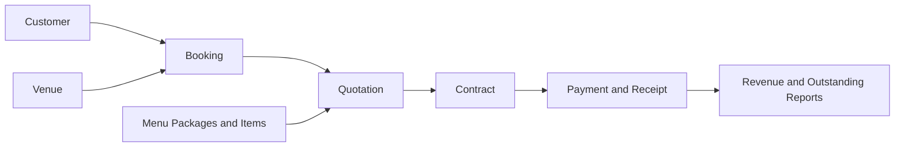
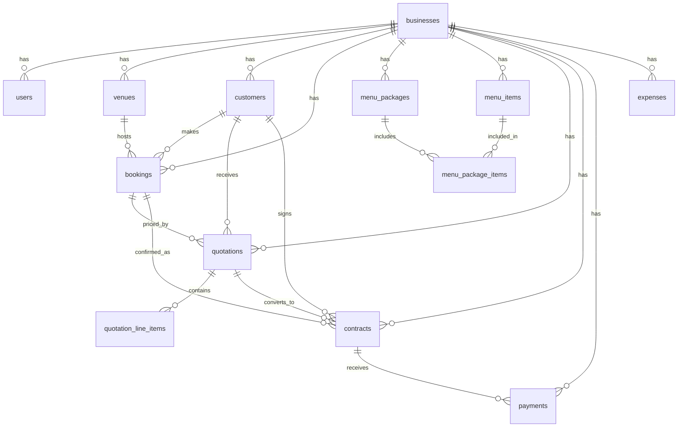

# Grand Alnoor ERP Architecture

Grand Alnoor ERP is a Next.js and Supabase event venue management system. It manages venue availability, customer records, bookings, quotations, contracts, payments, receipts, menu packages, and dashboard reporting.

## Technology Stack

- Frontend: Next.js 16 App Router, React 19, TypeScript
- Styling: Tailwind CSS v4
- Backend: Supabase PostgreSQL, Supabase Auth, Row Level Security
- Charts: Recharts
- Icons: Lucide React
- Dates: date-fns

## System Diagram

```mermaid
flowchart TD
  User[ERP User] --> App[Next.js App Router]

  App --> Public[Public Routes]
  App --> Dashboard[Dashboard Routes]

  Public --> Login[/login]
  Public --> Home[/ redirects to dashboard]

  Dashboard --> Layout[Dashboard Layout]
  Layout --> Sidebar[Sidebar]
  Layout --> TopBar[Top Bar]
  Layout --> Pages[Server Pages]
  Pages --> ClientComponents[Client Components]

  Pages --> ServerClient[Supabase Server Client]
  ClientComponents --> BrowserClient[Supabase Browser Client]

  ServerClient --> Auth[Supabase Auth]
  BrowserClient --> Auth
  ServerClient --> Database[(Supabase PostgreSQL)]
  BrowserClient --> Database

  Database --> RLS[Row Level Security]
```

## Business Workflow

```mermaid
flowchart LR
  Customer[Customer] --> Booking[Booking]
  Venue[Venue] --> Booking
  Booking --> Quotation[Quotation]
  Menu[Menu Packages and Items] --> Quotation
  Quotation --> Contract[Contract]
  Contract --> Payment[Payment and Receipt]
  Payment --> Dashboard[Revenue and Outstanding Reports]
```

## Data Model

```mermaid
erDiagram
  businesses ||--o{ users : has
  businesses ||--o{ venues : has
  businesses ||--o{ customers : has
  businesses ||--o{ bookings : has
  businesses ||--o{ menu_packages : has
  businesses ||--o{ menu_items : has
  businesses ||--o{ quotations : has
  businesses ||--o{ contracts : has
  businesses ||--o{ payments : has
  businesses ||--o{ expenses : has

  venues ||--o{ bookings : hosts
  customers ||--o{ bookings : makes
  customers ||--o{ quotations : receives
  customers ||--o{ contracts : signs

  bookings ||--o{ quotations : priced_by
  bookings ||--o{ contracts : confirmed_as
  quotations ||--o{ quotation_line_items : contains
  quotations ||--o{ contracts : converts_to
  contracts ||--o{ payments : receives

  menu_packages ||--o{ menu_package_items : includes
  menu_items ||--o{ menu_package_items : included_in
```

## Main Modules

- `app/dashboard/bookings`: reservation calendar, availability checks, customer attachment.
- `app/dashboard/quotations`: quote builder, line items, package pricing, print view.
- `app/dashboard/contracts`: accepted quote conversion, contract status, balances.
- `app/dashboard/payments`: payment ledger, discounts, refunds, receipts.
- `app/dashboard/customers`: customer directory and booking history.
- `app/dashboard/menu`: menu items and package composition.
- `app/dashboard/venues`: venue setup, capacity, base rental pricing.
- `app/dashboard`: revenue, discount, outstanding balance, and upcoming events.

## Security Model

All tenant-owned tables are scoped by `business_id`. Supabase Auth identifies the user, the `users.auth_id` row maps the user to a business, and RLS policies restrict reads/writes to that business. Join tables are protected through their parent records.

## Current Notes

- The schema uses the app's display-case values, such as `Confirmed`, `Full Day`, `Active`, and `Final Payment`.
- `quotations` and `contracts` both store `customer_id` for direct Supabase relationships.
- Menu package membership uses `menu_package_items`.
- Venue pricing uses `venues.base_price`, which quotation building can pull into line items.
